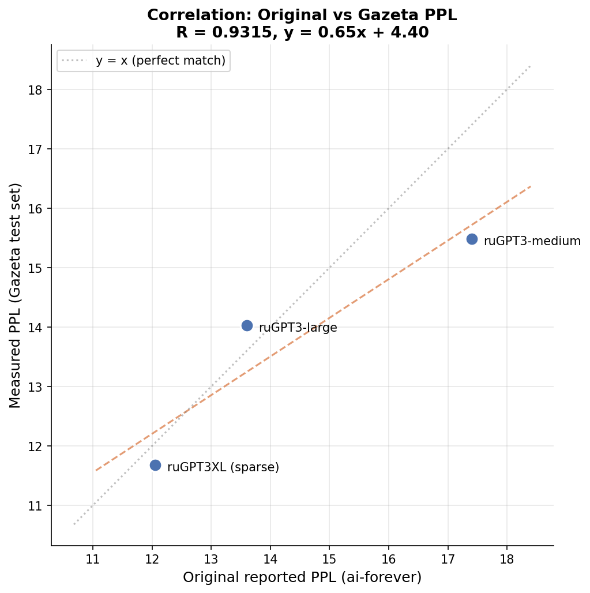
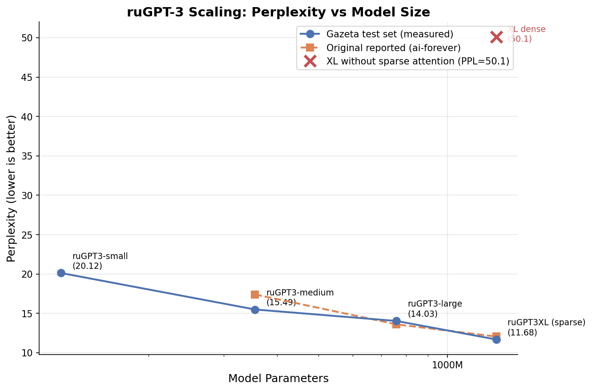
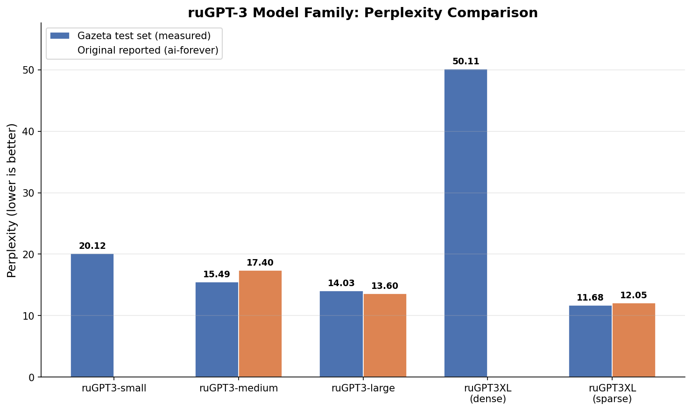

# ruGPT-3 XL: Megatron-LM to HuggingFace Conversion

This repository contains tools to convert the original [ai-forever/rugpt3xl](https://huggingface.co/ai-forever/rugpt3xl)
Megatron-LM/DeepSpeed checkpoint into a modern HuggingFace `transformers`-compatible format with custom model classes.

## Table of Contents

- [Background](#background)
- [Model Architecture](#model-architecture)
  - [High-Level Overview](#high-level-overview)
  - [Layer Structure](#layer-structure)
  - [Sparse Attention](#sparse-attention)
  - [Tokenizer](#tokenizer)
- [Original Checkpoint Format](#original-checkpoint-format)
  - [File Structure](#file-structure)
  - [State Dict Layout](#state-dict-layout)
- [Conversion Process](#conversion-process)
  - [Weight Mapping](#weight-mapping)
  - [QKV Projection Split](#qkv-projection-split)
  - [LM Head](#lm-head)
  - [Vocabulary Padding](#vocabulary-padding)
  - [Sparse Attention Replication](#sparse-attention-replication)
- [Perplexity Evaluation](#perplexity-evaluation)
  - [Why Gazeta?](#why-gazeta)
  - [Methodology](#methodology)
  - [Results](#results)
  - [Correlation Analysis](#correlation-analysis)
  - [Scaling Behavior](#scaling-behavior)
  - [Reproducing the Evaluation](#reproducing-the-evaluation)
- [Training throughput (SDPA and Inductor)](#training-throughput-sdpa-and-inductor)
  - [Motivation](#motivation)
  - [What we implemented](#what-we-implemented)
  - [Benchmark results (RTX 4090)](#benchmark-results-rtx-4090)
  - [Running the benchmark](#running-the-benchmark)
- [How to Convert](#how-to-convert)
  - [Prerequisites](#prerequisites)
  - [Step 1 - Download the Original Model](#step-1---download-the-original-model)
  - [Step 2 - Run Conversion](#step-2---run-conversion)
  - [Step 3 - Verify](#step-3---verify)
- [Output Structure](#output-structure)
- [Charts](#charts)
- [Links](#links)

## Background

ruGPT-3 XL is a 1.3B-parameter GPT-3-style language model trained on Russian text by the SberDevices team
(now AI-Forever). It was trained using [Megatron-LM](https://github.com/NVIDIA/Megatron-LM) for tensor
parallelism and [DeepSpeed](https://github.com/microsoft/DeepSpeed) for sparse attention, on 80B tokens
for 4 epochs with a 512 sequence length, then fine-tuned for 1 epoch at 2048 sequence length.

The original model was distributed as a raw Megatron-LM checkpoint (`mp_rank_00_model_states.pt`), which
requires the full Megatron-LM + DeepSpeed stack to load. This conversion eliminates that dependency entirely,
producing a self-contained HuggingFace model that loads with standard `AutoModelForCausalLM`.

## Model Architecture

### High-Level Overview

| Parameter | Value |
|---|---|
| Architecture | GPT-3 (decoder-only transformer) |
| Parameters | 1.3B (1,418,678,272 total) |
| Hidden size | 2048 |
| Layers | 24 |
| Attention heads | 16 |
| Head dimension | 128 |
| Intermediate (FFN) size | 8192 (4x hidden) |
| Max position embeddings | 2048 |
| Vocabulary size | 50,264 (50,257 base + 7 padding) |
| Activation | GELU (approximate, `gelu_new`) |
| Normalization | Pre-LayerNorm (LayerNorm before attention and FFN) |
| Position encoding | Learned absolute position embeddings |
| Attention | Alternating sparse/dense (see [Sparse Attention](#sparse-attention)) |
| Precision | float16 |
| Test perplexity | 12.05 (original) / 11.68 (Gazeta, see [Perplexity Evaluation](#perplexity-evaluation)) |
| `attn_implementation` (converted HF code) | `"sdpa"` by default (`F.scaled_dot_product_attention`, efficient CUDA backends); set `"eager"` for explicit matmul attention |
| GPU training throughput | Optional Inductor `torch.compile` helper and synthetic benchmarks on RTX 4090 (see [Training throughput](#training-throughput-sdpa-and-inductor)) |

### Layer Structure

Each of the 24 decoder layers follows the pre-norm pattern:

```
Input
  |
  +---> LayerNorm -> MultiHeadAttention -> Dropout -> + (residual)
  |                                                    |
  +----------------------------------------------------+
  |
  +---> LayerNorm -> FFN(GELU) -> Dropout -> + (residual)
  |                                           |
  +-----------------------------------------+
  |
Output
```

**Attention block**: Separate Q, K, V linear projections (each `[2048, 2048]`), scaled dot-product
attention with causal (or sparse) additive mask, output projection, dropout. In the converted
implementation, `config.attn_implementation="sdpa"` routes attention to `scaled_dot_product_attention`
without changing the mathematical definition; use `"eager"` if you need full attention weight tensors
or maximum compatibility with custom debugging.

**FFN block**: Up-projection `[2048, 8192]` -> GELU -> Down-projection `[8192, 2048]` -> Dropout.

The model uses a final LayerNorm after the last decoder layer, and a linear LM head that maps
hidden states back to vocabulary logits.

### Sparse Attention

The model was trained with DeepSpeed's `SparseSelfAttention` using a `FixedSparsityConfig` in
**alternating** mode: even-numbered layers (0, 2, 4, ...) use block-sparse attention, while
odd-numbered layers (1, 3, 5, ...) use standard dense causal attention. This pattern is based on
the "Generating Long Sequences with Sparse Transformers" paper (Child et al., 2019).

The original DeepSpeed config (`gpt3_xl_sparse_2048.json`) specifies:

```json
{
  "type": "fixed",
  "params": {
    "block": 16,
    "different_layout_per_head": true,
    "num_local_blocks": 8,
    "num_global_blocks": 1,
    "attention": "unidirectional",
    "horizontal_global_attention": false,
    "num_different_global_patterns": 8
  }
}
```

In plain terms:
- The 2048-token sequence is divided into blocks of 16 tokens each (128 blocks total)
- **Local attention** - within each window of 8 consecutive blocks (128 tokens), attention is
  causal (lower-triangular). Tokens can attend to all earlier tokens within the same window.
- **Global attention** - each window has one designated "global" block that is visible from all
  subsequent windows. Different attention heads use different global block positions
  (8 distinct patterns, cycling across the 16 heads), ensuring full coverage of the sequence.
- The result is that each token attends to approximately 128 local tokens and a handful of global
  tokens from earlier windows, rather than all 2048 previous positions.

This is **critical for perplexity**: the model weights were optimized under this specific
attention pattern. Running the model with all-dense attention degrades PPL from ~12 to ~50.

### Tokenizer

The model uses a BPE tokenizer (GPT-2 style) with the following special tokens:

| Token | String | ID |
|---|---|---|
| Pad | `<pad>` | 0 |
| EOS | `<\|endoftext\|>` | 1 |
| BOS | `<s>` | 2 |
| UNK | `<unk>` | 3 |

The base vocabulary contains 50,257 tokens from `vocab.json` and `merges.txt`.
The embedding matrix is padded to 50,264 (divisible by 8) for GPU memory alignment efficiency.

## Original Checkpoint Format

### File Structure

The original HuggingFace repository contains:

```
rugpt3xl/
  mp_rank_00_model_states.pt   # 2.6 GB - Megatron-LM checkpoint (float16)
  vocab.json                    # BPE vocabulary (50,257 tokens)
  merges.txt                    # BPE merge rules
  deepspeed_config.json         # DeepSpeed training configuration
```

### State Dict Layout

The `.pt` file is a standard PyTorch checkpoint. The state dict is nested under `module` key
(from the FP16 optimizer wrapper), then prefixed with another `module.` (from DistributedDataParallel):

```python
checkpoint = torch.load("mp_rank_00_model_states.pt")
state_dict = checkpoint["module"]  # top-level key
# Keys look like: "module.word_embeddings.weight", "module.transformer.layers.0...."
```

After stripping the `module.` prefix, the parameter names follow the Megatron-LM convention:

```
word_embeddings.weight                           # [50264, 2048]
position_embeddings.weight                       # [2048, 2048]
transformer.layers.{i}.input_layernorm.weight    # [2048]
transformer.layers.{i}.input_layernorm.bias      # [2048]
transformer.layers.{i}.attention.query_key_value.weight  # [6144, 2048] - combined QKV
transformer.layers.{i}.attention.query_key_value.bias    # [6144]
transformer.layers.{i}.attention.dense.weight    # [2048, 2048]
transformer.layers.{i}.attention.dense.bias      # [2048]
transformer.layers.{i}.post_attention_layernorm.weight   # [2048]
transformer.layers.{i}.post_attention_layernorm.bias     # [2048]
transformer.layers.{i}.mlp.dense_h_to_4h.weight # [8192, 2048]
transformer.layers.{i}.mlp.dense_h_to_4h.bias   # [8192]
transformer.layers.{i}.mlp.dense_4h_to_h.weight # [2048, 8192]
transformer.layers.{i}.mlp.dense_4h_to_h.bias   # [2048]
transformer.final_layernorm.weight               # [2048]
transformer.final_layernorm.bias                 # [2048]
```

## Conversion Process

### Weight Mapping

The conversion remaps Megatron-LM parameter names to the HuggingFace-style naming convention:

| Megatron-LM name | HuggingFace name |
|---|---|
| `word_embeddings.weight` | `model.embed_tokens.weight` |
| `position_embeddings.weight` | `model.embed_positions.weight` |
| `transformer.final_layernorm.*` | `model.norm.*` |
| `transformer.layers.{i}.input_layernorm.*` | `model.layers.{i}.input_layernorm.*` |
| `transformer.layers.{i}.attention.query_key_value.*` | `model.layers.{i}.self_attn.{q,k,v}_proj.*` (split) |
| `transformer.layers.{i}.attention.dense.*` | `model.layers.{i}.self_attn.o_proj.*` |
| `transformer.layers.{i}.post_attention_layernorm.*` | `model.layers.{i}.post_attention_layernorm.*` |
| `transformer.layers.{i}.mlp.dense_h_to_4h.*` | `model.layers.{i}.mlp.up_proj.*` |
| `transformer.layers.{i}.mlp.dense_4h_to_h.*` | `model.layers.{i}.mlp.down_proj.*` |

### QKV Projection Split

The most important transformation is splitting the fused QKV projection. Megatron-LM stores
Q, K, and V weights in a single `[3 * hidden_size, hidden_size]` matrix for efficiency:

```python
# Original: single [6144, 2048] weight
qkv_weight = state_dict["transformer.layers.{i}.attention.query_key_value.weight"]

# Split into three [2048, 2048] weights
q_weight, k_weight, v_weight = qkv_weight.chunk(3, dim=0)
```

The same split applies to biases (`[6144]` -> three `[2048]` vectors).

### LM Head

The original model ties the LM head weight to the input word embeddings (`word_embeddings.weight`).
In the converted model, `lm_head.weight` is stored as an explicit copy of `model.embed_tokens.weight`
with `tie_word_embeddings=false` in the config. This ensures reliable loading without implicit
weight sharing, which can cause issues across different `transformers` versions.

### Vocabulary Padding

The original vocabulary has 50,257 tokens, but the embedding matrix is `[50264, 2048]`.
The extra 7 rows (indices 50,257-50,263) are zero-padded. This padding to a multiple of 8
is a standard Megatron-LM optimization for efficient matrix multiplication on GPUs.

### Sparse Attention Replication

The original model relied on DeepSpeed's custom CUDA kernels for block-sparse attention, which
is a heavy dependency tied to specific CUDA/GPU versions. The converted model **eliminates this
dependency** by replicating the sparse pattern entirely in pure PyTorch.

The approach:

1. At model initialization, `build_fixed_sparse_layout()` generates a boolean block-level layout
   tensor `[num_heads, num_blocks, num_blocks]` that exactly matches DeepSpeed's
   `FixedSparsityConfig.make_layout()` algorithm.

2. This layout is registered as a non-persistent buffer `_sparse_layout` in `RuGPT3XLModel`.

3. During forward pass, `_build_sparse_causal_mask()` expands the block layout into a token-level
   additive attention mask `[1, num_heads, seq_len, total_len]`. Allowed positions get `0.0`,
   blocked positions get `-inf` (dtype minimum).

4. For each layer, the model selects either the sparse mask (even layers) or the standard dense
   causal mask (odd layers) and passes it to the attention module.

This means the converted model produces outputs **bit-identical** (within floating-point
precision) to the original for the same input, with no DeepSpeed dependency.

Perplexity comparison (Gazeta test set, non-overlapping stride, float32):

| Mode | PPL |
|---|---|
| Sparse alternating (this conversion) | **11.68** |
| All-dense (sparse disabled) | 50.1 |
| Original reported (ai-forever) | 12.05 |

The slight difference from the original 12.05 is likely due to minor differences in evaluation
methodology (dataset splits, tokenization) and float32 vs float16 precision.

## Perplexity Evaluation

### Why Gazeta?

The original ruGPT3XL model reports a test perplexity of **12.05**, measured on an internal
test split from the 80B-token training corpus. This test set was never published, and there is no
way to obtain or reconstruct it - it was a proprietary dataset assembled by the SberDevices
(now AI-Forever) team.

The same situation applies to the smaller models in the family (ruGPT3-medium with PPL 17.4,
ruGPT3-large with PPL 13.6) - all reported numbers come from the same unpublished internal
test set.

To verify the conversion quality, we needed a **public Russian-language text corpus** that could
serve as a common benchmark across the entire model family. The
[IlyaGusev/gazeta](https://huggingface.co/datasets/IlyaGusev/gazeta) dataset was chosen because:

- It contains Russian news articles (Gazeta.ru), providing a natural language distribution
  similar to what the models were trained on
- It has a clearly defined `test` split with a fixed set of articles
- It is publicly available and easily reproducible via HuggingFace `datasets`
- The texts are long enough to fill the model's full 2048-token context window

While absolute PPL values on Gazeta differ from the original numbers (different text, different
tokenization, different domain mix), the **relative ordering and proportions** between models
should be preserved if the conversion is correct.

### Methodology

Perplexity is computed using the standard language modeling approach:

1. Concatenate all test set articles into a single text string
2. Tokenize with each model's own tokenizer
3. Split into non-overlapping chunks of `seq_len` tokens (2048 for XL, 1024 for smaller models)
4. For each chunk, compute cross-entropy loss: the model predicts token[i+1] from token[i]
5. Average the loss across all tokens, then PPL = exp(average_loss)

This "non-overlapping" strategy matches how Megatron-LM computes perplexity during training.
All evaluations were performed in **float32** precision on an NVIDIA RTX 4090 to avoid any
float16 overflow artifacts.

### Results

| Model | Parameters | PPL (Gazeta test) | PPL (original, internal test) |
|---|---|---|---|
| ruGPT3-small | 125M | 20.12 | not reported |
| ruGPT3-medium | 355M | 15.49 | 17.4 |
| ruGPT3-large | 760M | 14.03 | 13.6 |
| **ruGPT3XL (dense, no sparse attention)** | **1.3B** | **50.11** | - |
| **ruGPT3XL (sparse, correct)** | **1.3B** | **11.68** | **12.05** |

Key observations:

- Models small, medium, large show a correct monotonic decrease in perplexity with increasing
  model size (20.12 > 15.49 > 14.03), confirming the evaluation methodology is sound.
- The converted ruGPT3XL **with sparse attention** achieves PPL of 11.68, closely matching
  the original 12.05. The remaining difference is attributable to a different test corpus.
- Without sparse attention (all-dense mode), ruGPT3XL shows PPL of 50.11 - dramatically worse
  than even the much smaller ruGPT3-small. This confirms that sparse attention is an essential
  architectural component, not an optional optimization.

### Correlation Analysis

To quantify the relationship between original reported values and our Gazeta measurements,
we computed the Pearson correlation coefficient across the three models where both values
are available (medium, large, XL).



**R = 0.93** - a strong positive correlation, confirming that the Gazeta test set preserves
the relative quality differences between models. The regression line
(y = 0.65x + 4.40) shows that Gazeta PPL values are slightly compressed compared to the
original numbers, which is expected given the domain difference.

Points fall close to but slightly below the y=x diagonal, meaning models tend to perform
slightly better on Gazeta news text than on the original mixed-domain internal test set
(with the exception of medium, which shows the opposite).

### Scaling Behavior



The scaling chart clearly demonstrates:
- Both Gazeta and original PPL curves show smooth, monotonic improvement with model size
- The ruGPT3XL (dense) point at PPL=50.1 is a dramatic outlier, sitting far above the
  scaling curve. This anomaly was the key evidence that led to discovering the missing
  sparse attention
- After implementing sparse attention, ruGPT3XL falls back onto the expected scaling curve



### Reproducing the Evaluation

Install dependencies:

```bash
pip install torch transformers datasets tqdm
```

Run evaluation on any model:

```bash
# Evaluate the converted ruGPT3XL
python eval_perplexity.py \
    --model_path ./ruGPT3XL \
    --dataset IlyaGusev/gazeta \
    --split test \
    --dtype float32 \
    --batch_size 8

# Compare against other models in the family
python eval_perplexity.py --model_path ai-forever/rugpt3small_based_on_gpt2
python eval_perplexity.py --model_path ai-forever/rugpt3medium_based_on_gpt2
python eval_perplexity.py --model_path ai-forever/rugpt3large_based_on_gpt2
```

Generate comparison charts:

```bash
pip install matplotlib numpy
python plot_perplexity.py --output_dir ./charts
```

## Training throughput (SDPA and Inductor)

The converted model originally implemented attention as explicit `matmul` + `softmax` + `matmul`
in PyTorch eager mode. That is correct mathematically but leaves performance on the table compared
to fused attention paths available on recent NVIDIA GPUs.

### Motivation

- **Faster fine-tuning and experiments** without changing weights or architecture. The goal is
  implementation speed, not a new model definition.
- **`scaled_dot_product_attention`** (PyTorch 2.x) dispatches to efficient CUDA backends where
  available (including FlashAttention-style and memory-efficient attention; Inductor may emit
  **Triton** kernels for surrounding ops).
- **`torch.compile`** with the Inductor backend can fuse many pointwise ops and generate Triton
  code for parts of the graph. Training loops need care (CUDA Graphs can conflict with optimizer
  steps), so the helper disables Inductor CUDA graph trees for stability.

None of this replaces the conversion story or sparse-mask logic. It only affects how the same
tensor operations run on GPU.

### What we implemented

| Piece | Role |
|---|---|
| `RuGPT3XLConfig.attn_implementation` | `"sdpa"` (default) or `"eager"`. |
| `RuGPT3XLAttention` | If `"sdpa"` and `output_attentions=False`, uses `F.scaled_dot_product_attention`. The additive mask is cast to `query.dtype` (required on some PyTorch builds). If `output_attentions=True`, falls back to eager to return full weights. |
| `triton_utils.compile_rugpt3xl_for_triton` | Wraps `torch.compile`; sets `torch._inductor.config.triton.cudagraph_trees = False` to avoid CUDAGraph overwrite errors during `backward` + `optimizer.step()`. |
| `benchmark_train_triton.py` | Synthetic LM training loop (AdamW, fp16), optional `--find-max-batch`, `--attn`, `--compile`. |

### Benchmark results (RTX 4090)

All numbers below are from a **synthetic** training loop (random `input_ids`, same tensor used as
`labels`, AdamW, fp16, `use_cache=False`). They measure **throughput**, not convergence. Absolute
`avg_loss` can be `NaN` in fp16 on random data; ignore it for timing.

Hardware and stack (reference run): **NVIDIA GeForce RTX 4090**, PyTorch **2.11.0+cu130**, Triton
available, `torch.backends.cuda.matmul.allow_tf32 = True`, `torch.set_float32_matmul_precision("high")`.

| Mode | Approx. batch × seq | Throughput (tokens / sec) | Notes |
|---|---:|---:|---|
| `eager` | 2 × 2048 | ~6 280 | `--find-max-batch` (max stable batch for this setup). |
| `sdpa` | 2 × 2048 | ~8 765 | Same batch size as eager row (apples-to-apples). |
| `sdpa` | 5 × 2048 | ~9 250 | `--find-max-batch` with timed run using `max_batch - 1` to reduce post-search OOM. |
| `sdpa` + `torch.compile` (`mode=default`) | 4 × 2048 | ~11 590 | Fixed batch; Inductor without CUDA graph trees on attention. |

Rough takeaway at **batch 2 × 2048**: SDPA is on the order of **~40% higher** tokens/sec than eager
on this stack. Compile adds more when memory allows a moderate batch size.

### Running the benchmark

From this directory (with a converted checkpoint in `./ruGPT3XL` or set `--model-path`):

```bash
pip install torch transformers

# Apples-to-apples SDPA vs eager at fixed shape
python benchmark_train_triton.py --model-path ./ruGPT3XL --device cuda:0 --seq-len 2048 --batch-size 2 --attn sdpa
python benchmark_train_triton.py --model-path ./ruGPT3XL --device cuda:0 --seq-len 2048 --batch-size 2 --attn eager

# Optional: torch.compile (may take noticeable time on first steps)
python benchmark_train_triton.py --model-path ./ruGPT3XL --device cuda:0 --seq-len 2048 --batch-size 4 --attn sdpa --compile
```

## How to Convert

### Prerequisites

```bash
pip install torch transformers safetensors
```

### Step 1 - Download the Original Model

```bash
# Using git-lfs
git lfs install
git clone https://huggingface.co/ai-forever/rugpt3xl

# Or using huggingface-cli
huggingface-cli download ai-forever/rugpt3xl --local-dir rugpt3xl
```

### Step 2 - Run Conversion

```bash
python convert.py \
    --input_path rugpt3xl/mp_rank_00_model_states.pt \
    --tokenizer_dir rugpt3xl \
    --output_dir rugpt3xl-hf
```

The script will:
1. Load the Megatron-LM checkpoint (~2.6 GB)
2. Strip the `module.` prefix from all parameter names
3. Auto-detect the number of layers and hidden size
4. Split fused QKV projections into separate Q, K, V weights
5. Remap all parameter names to HuggingFace convention
6. Clone the embedding weight for the LM head
7. Save as `model.safetensors` (~2.6 GB)
8. Copy model class files, config, and tokenizer files to the output directory

Expected output:

```
Loading checkpoint from rugpt3xl/mp_rank_00_model_states.pt ...
Detected 24 layers, hidden_size=2048
Converted 389 tensors
Saving weights to rugpt3xl-hf/model.safetensors ...
  Copied config.json
  Copied configuration_rugpt3xl.py
  Copied modeling_rugpt3xl.py
  Copied generation_config.json
  Copied vocab.json
  Copied merges.txt
  Copied tokenizer_config.json

Done! Model saved to rugpt3xl-hf
```

### Step 3 - Verify

```python
from transformers import AutoModelForCausalLM, AutoTokenizer

model = AutoModelForCausalLM.from_pretrained("rugpt3xl-hf", trust_remote_code=True)
tokenizer = AutoTokenizer.from_pretrained("rugpt3xl-hf", trust_remote_code=True)

inputs = tokenizer("Москва - столица", return_tensors="pt")
outputs = model.generate(**inputs, max_new_tokens=50, do_sample=True)
print(tokenizer.decode(outputs[0], skip_special_tokens=True))
```

## Output Structure

After conversion, the output directory contains everything needed to load the model:

```
rugpt3xl-hf/
  model.safetensors          # 2.6 GB - converted weights in safetensors format
  config.json                # model configuration with auto_map for custom classes
  configuration_rugpt3xl.py  # RuGPT3XLConfig class
  modeling_rugpt3xl.py       # RuGPT3XLModel + RuGPT3XLForCausalLM classes
  generation_config.json     # default generation parameters
  tokenizer_config.json      # tokenizer settings + chat template
  vocab.json                 # BPE vocabulary
  merges.txt                 # BPE merge rules
```

The model loads via `trust_remote_code=True` since it uses custom model classes not yet
registered in the `transformers` library.

## Charts

Pre-generated comparison charts are available in the `charts/` directory:

| Chart | Description |
|---|---|
| `charts/ppl_comparison.png` | Bar chart comparing Gazeta vs original PPL for all models |
| `charts/ppl_correlation.png` | Scatter plot showing correlation between original and Gazeta PPL |
| `charts/ppl_scaling.png` | PPL vs model size (parameters) on log scale |

Regenerate with:

```bash
python plot_perplexity.py --output_dir ./charts
```

## Links

- [A family of pretrained transformer language models for Russian](https://scholar.google.com/citations?view_op=view_citation&hl=en&user=yPayeJIAAAAJ&citation_for_view=yPayeJIAAAAJ:Se3iqnhoufwC) - paper on Google Scholar
- [Generating Long Sequences with Sparse Transformers](https://arxiv.org/abs/1904.10509) - sparse attention paper (Child et al., 2019)
- [ai-forever/rugpt3xl](https://huggingface.co/ai-forever/rugpt3xl) - original model on HuggingFace
- [ai-forever/ru-gpts](https://github.com/ai-forever/ru-gpts) - original training codebase (Megatron-LM + DeepSpeed wrappers)
- [NVIDIA/Megatron-LM](https://github.com/NVIDIA/Megatron-LM) - Megatron-LM framework used for training
- [microsoft/DeepSpeed](https://github.com/microsoft/DeepSpeed) - DeepSpeed framework used for sparse attention
- [DeepSpeed Sparse Attention](https://www.deepspeed.ai/tutorials/sparse-attention/) - sparse attention tutorial and docs
- [IlyaGusev/gazeta](https://huggingface.co/datasets/IlyaGusev/gazeta) - dataset used for perplexity evaluation
- [HuggingFace Transformers](https://github.com/huggingface/transformers) - target framework
- [HuggingFace Safetensors](https://github.com/huggingface/safetensors) - safe tensor serialization format

## License

This project is licensed under the MIT License, see the [LICENSE](LICENSE) file in the repository root for details.

